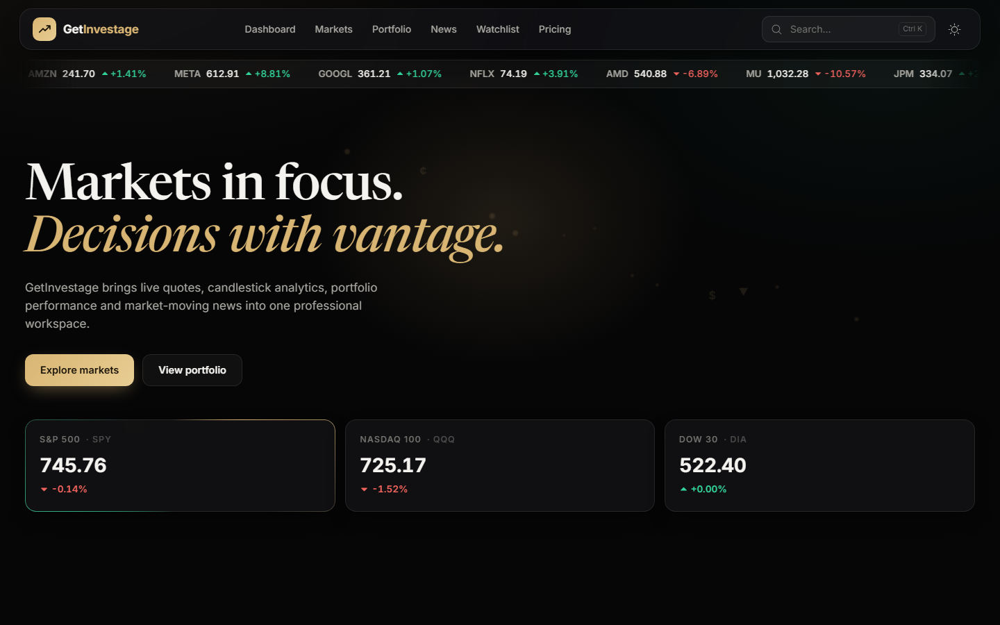
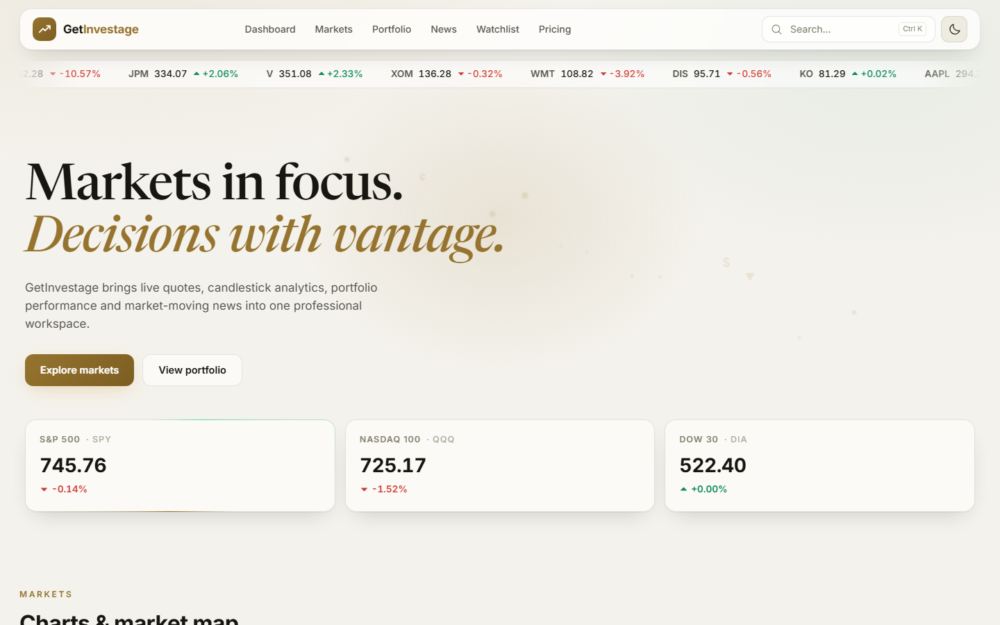
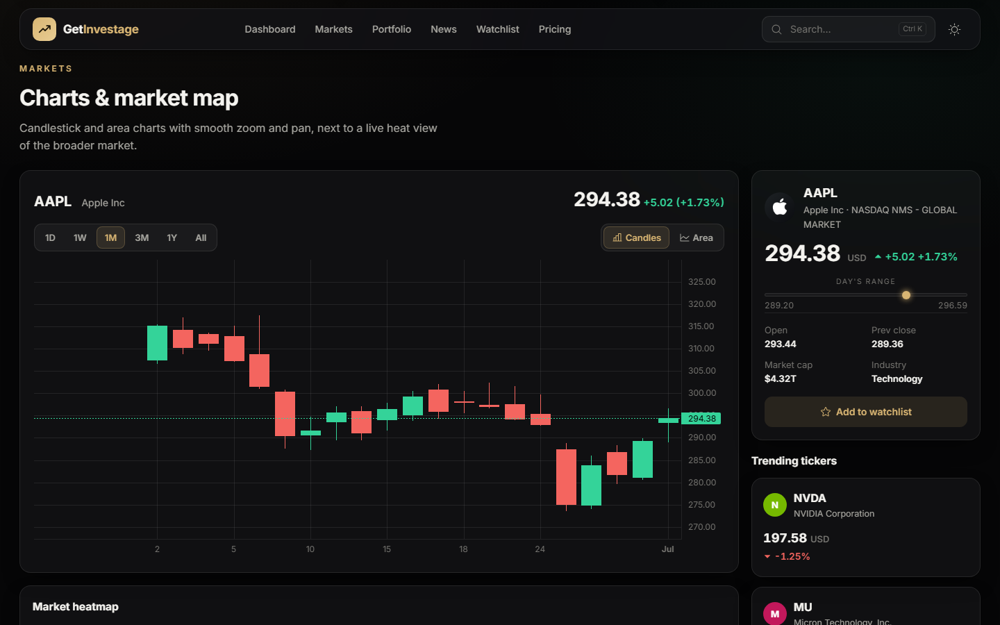

# GetInvestage — Markets, Portfolio & Research

A professional market workspace: live quotes, candlestick analytics, portfolio
performance, market heatmap, screener and financial news — in a black
"liquid glass" theme with a warm light variant.
Slice 1 of a larger RAG-powered equity research assistant (FastAPI + React).

| Dark (default) | Light |
|---|---|
|  |  |



## Features

- **Candlestick + area charts** via TradingView's [lightweight-charts](https://github.com/tradingview/lightweight-charts) — smooth zoom/pan that survives live refreshes, 1D / 1W / 1M / 3M / 1Y / All ranges
- **Real market data** — Finnhub for quotes, search, profiles and news; Yahoo Finance chart API for OHLC history (Finnhub's candle endpoint is premium-only)
- **Landing-style sections**: hero with live index counters and mouse-follow glow, scrolling ticker tape, market heatmap, sample portfolio with animated P/L metrics, stock screener, news cards, pricing, footer
- **Live market alerts** — toasts slide in when a tracked symbol moves ≥1%
- **Black / light themes** with semantic glass tokens, persisted, no flash on load
- **Watchlist** (localStorage-persisted) with row flash animations on price moves
- **Symbol search** (Ctrl+K) with keyboard navigation
- **Framer Motion** section reveals, spring toasts, animated counters; `prefers-reduced-motion` respected
- **Graceful degradation**: SQLite TTL cache with serve-stale-on-error; synthetic fallback data is always labeled in the UI

**Logo:** drop your logo file at `frontend/public/logo.png` — it's picked up
automatically (a gold monogram renders until then).

## Architecture

```
backend/  (FastAPI, Python)                 frontend/  (React 19 + Vite + TS)
  main.py            API routes + CORS        src/App.tsx          layout + state
  services/market.py Finnhub + Yahoo client   src/components/      TopBar, ChartPanel,
  services/cache.py  SQLite TTL cache                              Watchlist, SymbolCard,
  services/demo_data.py  synthetic fallback                        IndicesStrip, Trends, News
```

The API key never reaches the browser — the React app only talks to the FastAPI
backend, which proxies Finnhub server-side.

## Run locally

**Backend** (Python 3.12+):

```powershell
cd backend
python -m venv .venv
.venv\Scripts\pip install -r requirements.txt
copy .env.example .env   # then put your free Finnhub key in .env
.venv\Scripts\python -m uvicorn main:app --reload --port 8000
```

**Frontend** (Node 20+):

```powershell
cd frontend
npm install
npm run dev              # http://localhost:5173 (proxies /api to :8000)
```

Without a `FINNHUB_API_KEY` the app still works: quotes and candles come from
Yahoo's public chart API; search, profiles and news fall back to labeled demo
data (the top bar shows a "No API key" badge).

## API

| Endpoint | Description |
|---|---|
| `GET /api/quote/{symbol}` | Live quote (404 unknown symbol, 503 provider down) |
| `GET /api/candles/{symbol}?range=1M` | OHLCV history; `source` field labels data origin |
| `GET /api/search?q=` | Symbol search |
| `GET /api/profile/{symbol}` | Company profile |
| `GET /api/news/{symbol}` | Recent company news |
| `GET /api/indices` | Index-proxy quotes for the top strip |
| `GET /api/health` | Health + demo-mode flag |

## Deployment (planned — Slice 0/1 target)

Render (FastAPI, `FINNHUB_API_KEY` + `FRONTEND_ORIGINS` env vars) + Vercel
(React, `VITE_API_URL` pointing at Render). CORS is restricted to
`FRONTEND_ORIGINS`.

## Roadmap

1. ~~Dashboard (this)~~
2. Numeric assistant — LLM tool-calling against the market service
3. RAG over news + SEC filings with cited answers
4. Eval set + README results
