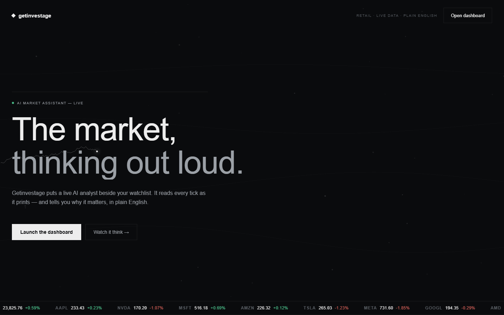
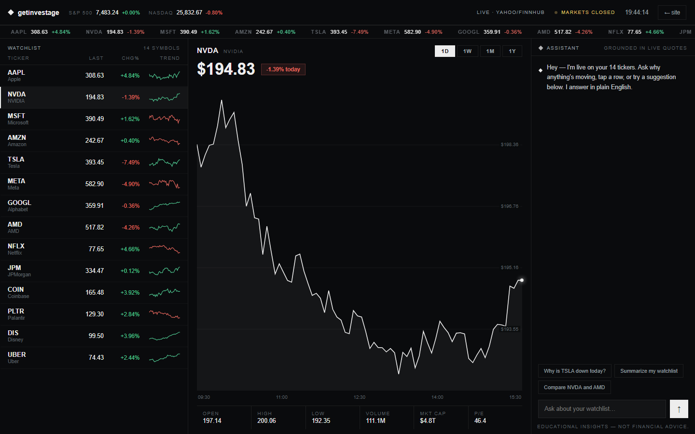

# Getinvestage

A dark, terminal-style stock market dashboard with real-time data, interactive charts, and an AI-powered recommendation engine. Built as a full-stack portfolio project.

**Educational tool — not financial advice.**

| Landing | Dashboard |
|---|---|
|  |  |

## Tech Stack

| Layer | Technology |
|---|---|
| Frontend | React 18, Vite, vanilla CSS |
| Backend | FastAPI, Python 3.12, uvicorn |
| Database | PostgreSQL (Neon in production) |
| AI | Gemini 2.5 Flash (recommendations) |
| Market Data | Finnhub + Yahoo Finance |
| Cache | Redis (Upstash) / SQLite fallback |
| Auth | JWT access + refresh tokens, argon2 password hashing |
| Deployment | Docker, Render |

## Features

- **Live dashboard** — real-time quotes, watchlist, ticker tape
- **Interactive charts** — self-drawing SVG candlestick/line charts with 1D to ALL range
- **AI recommendations** — scoring-first pipeline with Gemini-backed explanations
- **Grounded assistant** — compares tickers, explains sectors, refuses financial advice
- **Auth system** — register/login with JWT rotation, rate limiting, server-side revocation
- **Offline fallback** — labeled simulation mode when the backend is unreachable

## Project Structure

```
getinvestage/          React frontend (Vite)
  src/
    components/        Landing, Dashboard, Watchlist, PriceChart, Assistant, TickerTape
    useMarket.js       Live market engine: quote polling + candle history
    assistant.js       Grounded response logic over live quote state

backend/               FastAPI backend
  main.py              API routes + serves built React SPA in production
  api/                 Route handlers (auth, watchlist, market, recommendations)
  core/                Config, database, security, rate limiting
  models/              SQLAlchemy models (User, WatchlistItem, RefreshToken)
  services/            Market data service, cache, demo data, recommendations
  alembic/             Database migrations
```

## Setup

### Prerequisites

- Python 3.12+
- Node 20+
- Docker

### 1. Start the database

```bash
docker compose up -d
```

This runs PostgreSQL on `localhost:5432`.

### 2. Backend

```bash
cd backend
python -m venv .venv
source .venv/bin/activate
pip install -r requirements.txt
cp .env.example .env              # add your API keys
alembic upgrade head              # run migrations
uvicorn main:app --port 8000
```

### 3. Frontend

```bash
cd getinvestage
npm install
npm run dev                       # http://localhost:5174
```

Vite proxies `/api` requests to the backend at `:8000`.

### Production build

```bash
cd getinvestage && npm run build  # outputs to getinvestage/dist
```

FastAPI serves the built SPA from `getinvestage/dist` — open `http://localhost:8000` for the full production setup.

## Environment Variables

| Variable | Required | Description |
|---|---|---|
| `DATABASE_URL` | Yes | PostgreSQL connection string |
| `FINNHUB_API_KEY` | Recommended | Free at [finnhub.io](https://finnhub.io/register). Without it, the app runs in demo mode with synthetic data |
| `GEMINI_API_KEY` | Optional | For AI recommendations. Get one at [aistudio.google.com](https://aistudio.google.com/apikey) |
| `SECRET_KEY` | Prod only | JWT signing key. Auto-generated in dev |
| `REDIS_URL` | Optional | Shared cache + rate limiting (Upstash). Falls back to in-process |

## API

| Endpoint | Description |
|---|---|
| `GET /api/quotes?symbols=AAPL,TSLA` | Batch quotes |
| `GET /api/quote/{symbol}` | Single quote |
| `GET /api/candles/{symbol}?range=1D` | OHLCV chart data (1D, 1W, 1M, 3M, 1Y, ALL) |
| `GET /api/search?q=apple` | Symbol search |
| `GET /api/profile/{symbol}` | Company profile |
| `GET /api/news/{symbol}` | Company news |
| `POST /api/recommend` | AI-ranked recommendations |
| `GET /api/health` | Health check + demo mode flag |

## Deployment

The app deploys as a single Docker container on **Render**:

```
Browser → Render (Docker) → Neon Postgres
                           → Upstash Redis (optional)
                           → Finnhub / Yahoo Finance
```

The [Dockerfile](Dockerfile) is multi-stage: Node builds the SPA, Python serves everything. Migrations run automatically on container start.

See [render.yaml](render.yaml) for the blueprint configuration.
